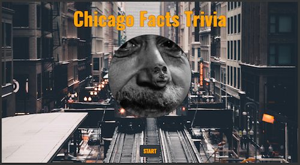
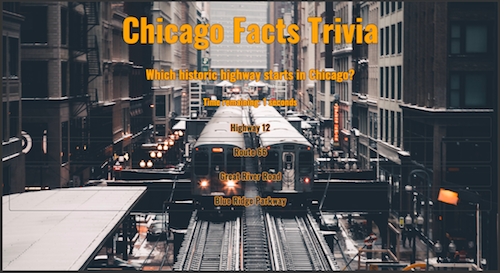
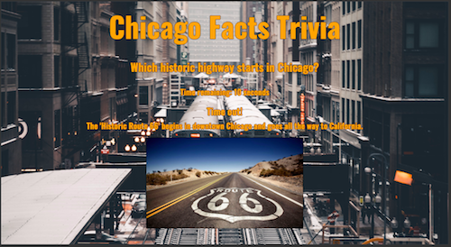
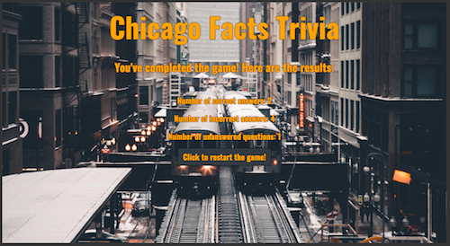

# TriviaGame
Game: Trivia Chicago \
Created for: Northwestern Coding Bootcamp \
Developer: Natalia Kukula \
Deployment Date:  October 4, 2018 \
Published: GitHub <https://nataliakukula.github.io/TriviaGame/> \
Built with: HTML5, CSS3, Bootstrap, Javascript & jQuery

## Summary: 






1. Screen 1: The player initializes the trivia game with a start button.

2. Screen 2: The player has 30 seconds for each question and chooses the answer from 4 buttons.

3. Screen 3: After each question the player will see an answer screen for 5 seconds.
```
The screen appears when:
* The player clicks a button with the right answer (Generates: "Correct!")
* The player clicks a button with the wrong answer (Generates: "Incorrect!")
* The timer on the question 'Screen 2' runs out (Generates: "Time Out!")
```

4. Screen 4: Game ends

* The game is over when the player goes through all the question.

* After 5 seconds the end game screen appears with the statistics.

* The player can restart the game with the 'Click to restart the game!' button. 

## Notes:

This northwestern coding bootcamp homework has been challenging.

It was difficults to dinamically create buttons and connecting the logic was the toughest part.

6 weeks stading! 💪🏼